## github-test

### Описание проекта

Проект GitHub Test - это автоматизированный набор тестов для проверки функциональности GitHub.
Он включает в себя API-тесты для взаимодействия с GitHub API и UI-тесты для проверки пользовательского интерфейса.

[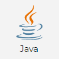](https://www.oracle.com/ru/java/technologies/javase-jre8-downloads.html)
[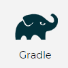](https://gradle.org/)
[](https://junit.org/junit5/)
[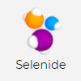](https://ru.selenide.org/)
[](https://rest-assured.io/)
[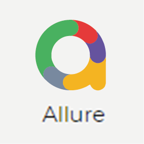](https://docs.qameta.io/allure/)
[](https://www.jenkins.io/)
[](https://aerokube.com/selenoid/latest/)

Проект представляет собой набор автоматизированных тестов, включающих API- и UI-тесты. Он разделен на следующие модули:

API-тесты:

1. **CreationRepositoryTest** - создание репозитория.
    - `testCreateRepository`: тест для создания репозитория.
    - `testCreateRepositoryWithExistingName`:  тест для создания репозитория с уже существующим именем.
2. **RepositoryZipDownloadAndReadTest** - скачивание и чтение содержимого репозитория.
    - `testDownloadAndReadFileContentFromZipReadme`: тест для скачивания и чтения содержимого файла README из ZIP-архива.
    - `testDownloadAndReadNonexistentFileFromZip`: тест для скачивания и чтения содержимого несуществующего файла из ZIP-архива.
3. **UserRepositoriesTest** - получение списка репозиториев пользователя.
    - `testListOfUserRepositories`: тест для получения списка репозиториев пользователя.
4. **RenameRepositoryTest** - переименование репозитория.
    - `renameRepository`: тест для успешного переименования репозитория.
5. **UploadFileRepositoryTest** - загрузка файла в репозиторий.
    - `UploadFileTest`:тест для успешной загрузки файла в репозиторий.

UI-тесты:

1. **LoginTest** - авторизации.
    - `testSuccessfulLogin`: успешный вход в систему.
    - `testLoginWithInvalidEmail`: вход в систему с недопустимым email.
    - `testLoginWithInvalidPassword`: вход в систему с недопустимым паролем.
2. **ScreenShootTest** - скриншоты страниц.
    - `testMainPageHeader`: скриншот заголовка главной страницы.
    - `testLoginBody`: скриншот тела формы входа.
3.  **SearchTest**  - тест на поиск.
    - `testSearch`: поиск на главной странице.
    - `testAdvancedSearch`: расширенноый поиск.
4.  **UnauthenticatedTests** - включает в себя тесты для неаутентифицированных пользователей.
    - `testMainPageLoads`: загрузка главной страницы.

Дополнительный функционал: проверка дипловом курса qa.guru

1. **CheckProjectTest** - проверка комплектность данных проекта и наличие основных компонентов.
   - `testSearchInDownloadedFile`: поиск ключевых слов в скачанном файле.
   - `testForEmptyStrings`: проверка на избыточные пустые строки подряд.


### Настройка и запуск тестов

Вы можете запустить тесты локально или удаленно. Для конфигурации тестов вы можете использовать следующие системные
свойства:

- `ownerName` - имя владельца репозитория (по умолчанию "SLomako").
- `repoUnderTest` - репозиторий для тестирования (по умолчанию "SLomako/github-tester").
- `searchRepo` - репозиторий для поиска (по умолчанию "SLomako/github-tester").
- `searchResult` - ожидаемый результат поиска (по умолчанию "github-tester").
- `advancedSearchLanguage` - язык для расширенного поиска (по умолчанию "Java").
- `advancedSearchFrom` - источник для расширенного поиска (по умолчанию "Slomako").
- `advancedSearchDate` - дата для расширенного поиска (по умолчанию "2023").

### Локальный запуск

Для локального запуска тестов используйте команду:

```bash
gradle clean test
```

### Удаленный запуск

Для удаленного запуска тестов используйте команду:

```bash
gradle clean test -DisRemote=true
```

### Запуск с Jenkins

Если вы используете Jenkins для запуска тестов, вы можете использовать параметризованную сборку с следующими
параметрами:

- `BASE_URL` - окружение (например, "https://github.com").
- `BROWSER_AND_VERSION` - браузер и версия в Selenoid (например, "chrome,100.0").
- `BROWSER_SIZE` - разрешение экрана (например, "1920x1080").
- `REPO_UNDER_TEST` - выбор репозитория для проверки требований к проекту (например, "SLomako/github-tester").

### Файл test.properties

Для запуска тестов локально на вашем компьютере, вам необходимо добавить файл test.properties в папку ресурсов (test/src/resources/config/). В этом файле необходимо указать следующие свойства:

```bash 
login.gitHub=GitHub_login
password.gitHub=GitHub_password
selenoid.username=Selenoid_username
selenoid.password=Selenoid_password
api.token.github=GitHub_token
ui.browserWithVersion=browser_and_version
ui.browserSize=Screen_size
ui.baseURL=BaseURL
ui.remoteURL=Remote_host_URL
ui.isRemote=Run_on_remote_host
```

### Ссылки и визуализация

Ниже представлены скриншоты основных инструментов и процессов, используемых в ходе разработки и тестирования проекта. Вы
можете развернуть каждый раздел, чтобы увидеть подробности.

<details>
  <summary>IntelliJ IDEA</summary>

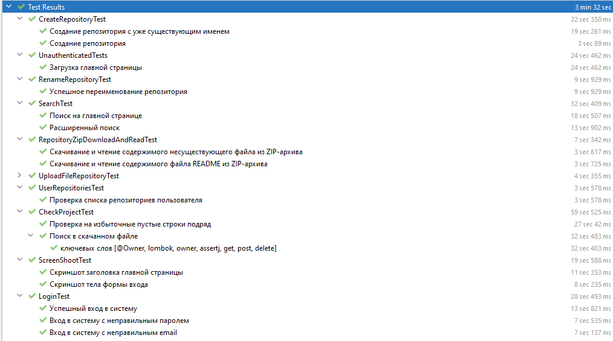
</details>

<details>
  <summary>Jenkins</summary>

[Перейти к сборке в Jenkins](https://jenkins.autotests.cloud/job/Students/job/18-lom14-github-tester/)

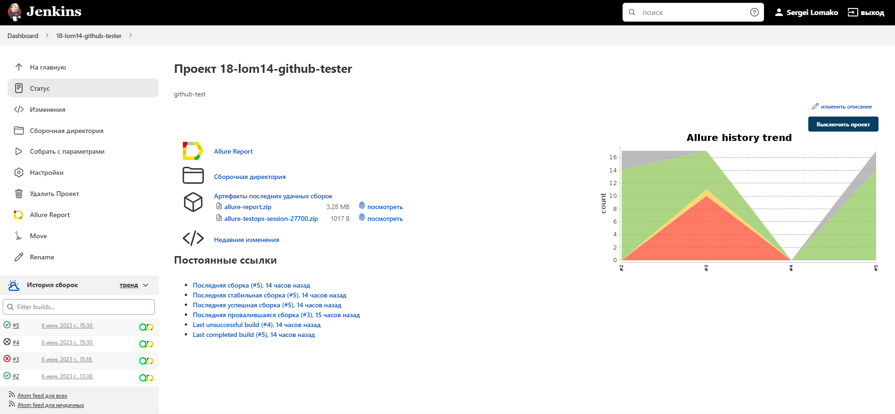
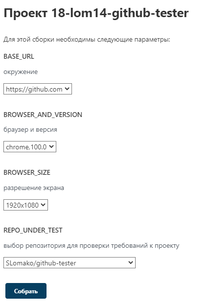
</details>

<details>
  <summary>AllureReport</summary>

[Перейти к отчету в AllureReport](https://jenkins.autotests.cloud/job/Students/job/18-lom14-github-tester/12/allure/)

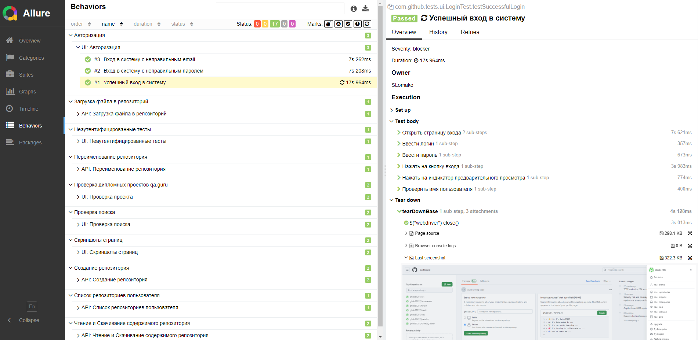

</details>

<details>
  <summary>AllureTestOps</summary>

[Перейти к отчету AllureTestOps](https://allure.autotests.cloud/project/3349/dashboards)

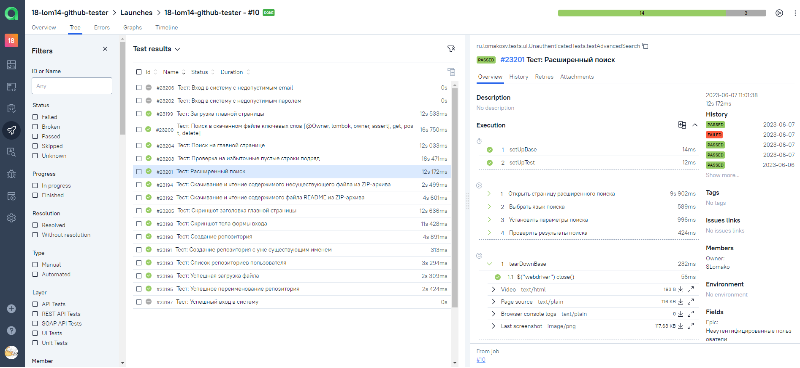
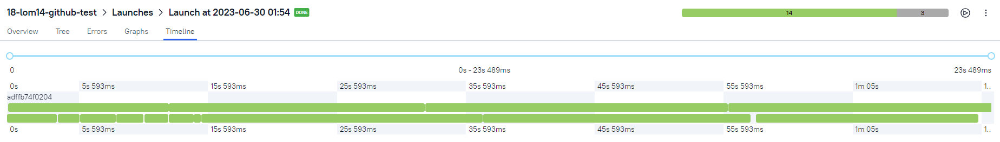
</details>

<details>
  <summary>Уведомление Telegram</summary>

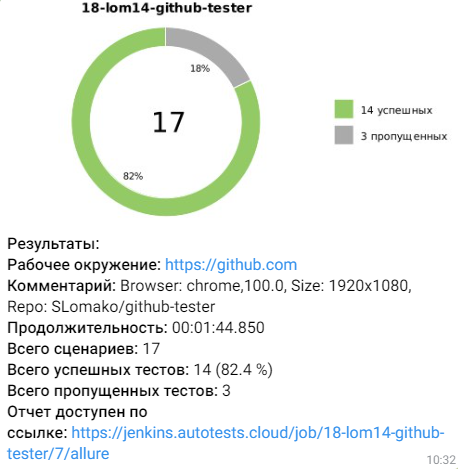
</details>

<details>
  <summary>Демонстрационное видео запуска тестов через AllureTestOps</summary>

[Скачать демонстрационное видео](.github/video/allure-testops-google-chrome.mp4)
</details>

### Контакты

[](https://t.me/lom14)
